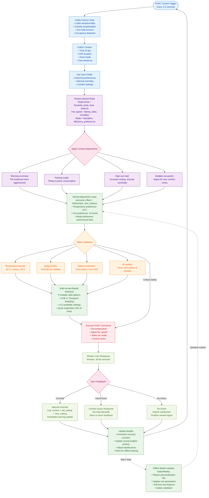

telemetry.signals
{
  "ts": "2025-08-01T08:15:00Z",
  "user_id": "driver_001",
  "vehicle_id": "VIN001",
  "trip_id": "3f778d19dc06",
  "state": {
    "outside_temp_c": 29.8,
    "cabin_temp_c": 28.9,
    "humidity_pct": 55.0,
    "solar_w_m2": 161.6,
    "occupants": {"driver": true, "front_passenger": false, "rear_count": 2},
    "trip_type": "commute",
    "time_of_day": "morning",
    "dow": "Fri",
    "location_hash": "LOC_…",
    "speed_kmh": 9.7,
    "precipitation": false,
    "traffic": "high",
    "calendar_hint": "meeting_9am",
    "recent_overrides_7d": 3
  }
}

system.suggestion

One per domain per decision point.

Includes a propensity (probability of the chosen action within the local candidate set), confidence, and a short explanation.
{
  "ts": "2025-08-01T08:15:00Z",
  "user_id": "driver_001",
  "vehicle_id": "VIN001",
  "trip_id": "3f778d19dc06",
  "domain": "HVAC",
  "suggestion_id": "f7e…c12",
  "policy_version": "policy_v1.0",
  "propensity": 0.42,
  "candidate_count": 7,
  "confidence": 0.53,
  "candidate_example": {"setpoint_c": 20, "fan": 2, "airflow_mode": "auto", "ac_on": true, "recirculation": true},
  "suggestion": {"setpoint_c": 20, "fan": 2, "airflow_mode": "auto", "ac_on": true, "recirculation": true},
  "explanation": "Because it's morning and outside is 30°C with high traffic and solar 160 W/m²."
}

user.action

The system‑applied setting (origin: "system") plus any user override within 5–60s (origin: "user"), both tied back via suggestion_id.
{
  "ts": "2025-08-01T08:15:00Z",
  "user_id": "driver_001",
  "trip_id": "3f778d19dc06",
  "domain": "HVAC",
  "parameter": "bulk",
  "value": {"setpoint_c": 20, "fan": 2, "airflow_mode": "auto", "ac_on": true, "recirculation": true},
  "origin": "system",
  "suggestion_id": "f7e…c12"
}

training.feedback

Outcome at ts + 60s with reward shaping (here binary: kept=1.0, override=0.0) and occasional explicit thumbs up/down.
{
  "ts": "2025-08-01T08:16:00Z",
  "user_id": "driver_001",
  "trip_id": "3f778d19dc06",
  "domain": "HVAC",
  "suggestion_id": "f7e…c12",
  "outcome": {"kept": false, "override_within_s": 26, "explicit_feedback": null},
  "reward": 0.0
}
How the generator behaves

Drivers & profiles: 8 drivers with distinct clusters (e.g., cool_mornings, very_cool), recirculation & fan‑noise preferences, seat‑heat thresholds, music preferences per time of day, base volume, and destination habits (work/home/daycare/gym/grocery).

Contexts: realistic time‑of‑day (morning/evening commutes plus midday leisure), traffic‑dependent speeds, stochastic outside temp, humidity from precipitation, solar intensity by hour and clouds, basic calendar hints, and occupant counts.

Domains simulated: HVAC, Infotainment, Navigation always/frequently, plus Comfort & Lighting about half the time.

Policy + candidates: a small, interpretable baseline policy per domain proposes a suggestion; we build a local candidate set (nearby actions) and compute propensities via a simple acceptance model → chosen action is sampled accordingly (so logs have a proper propensity for OPE).

User response: acceptance probability depends on distance to the driver’s latent preference (e.g., setpoint gap, source/volume mismatch, top‑k destination accuracy). Overrides generate user.action with the new setting and negative reward; kept suggestions get positive reward.

Customize volume/behavior

tweak:

NUM_DRIVERS, DAYS_PER_DRIVER, GENERATE_DOMAINS

Acceptance sharpness via each domain’s accept_prob_* functions

Candidate set size (neighbors) and propensity sharpness (the *3.0 in softmax(scores * 3.0))

Reward window KEEP_WINDOW_S

Regenerate files to create a larger or differently‑shaped dataset.

